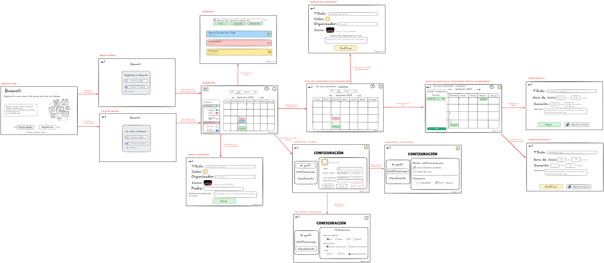
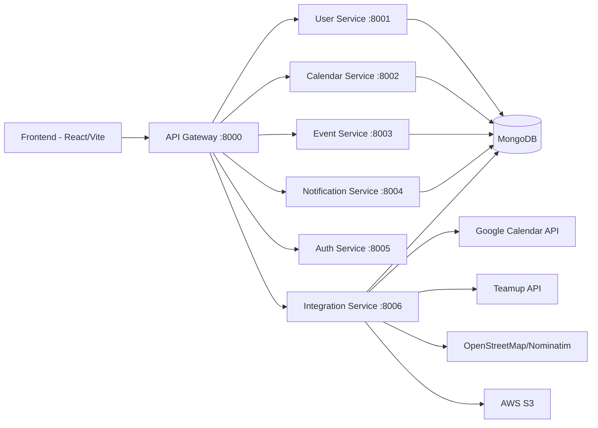

<div align="center">
  

  # Basmati

  <p>Calendar and event platform built with React, FastAPI, and MongoDB.</p>

  <p>
    <a href="https://github.com/arrozet/basmati/blob/main/LICENSE">
      
    </a>
    <a href="https://github.com/arrozet/basmati/actions/workflows/deploy.yml">
      
    </a>
    <a href="https://github.com/arrozet/basmati">
      
    </a>
    <a href="https://github.com/arrozet/basmati">
      
    </a>
    <a href="https://github.com/arrozet/basmati/stargazers">
      
    </a>
  </p>
</div>

Basmati is a full-stack calendar platform for teams and communities that need one place to organize events, calendars, comments, notifications, and external imports.

## Preview



<!-- Live demo: add URL when publicly available -->

## Why this project

Calendar data is often fragmented between providers, personal tools, and team-specific workflows. Basmati centralizes that information behind one frontend and one API entry point, while keeping backend responsibilities split into focused services.

## Key capabilities

- Hierarchical calendars (parent/child structure) with inherited visibility and recursive event loading.
- Multi-view calendar UI (year, month, week, day) optimized for dense event timelines.
- Event details with comments, location rendering, and attachment support.
- Integrated authentication flow with Google OAuth plus development-user mode for local testing.
- Cross-service integrations for Google Calendar, Teamup, OpenStreetMap geocoding, and S3 image uploads.
- API Gateway that proxies versioned endpoints and aggregates OpenAPI docs from backend services.

## Architecture



### Services

| Service | Port | Responsibility |
| --- | --- | --- |
| `api-gateway` | 8000 | Single entry point, proxy routing, OpenAPI aggregation |
| `user-service` | 8001 | User profiles and preferences |
| `calendar-service` | 8002 | Calendar CRUD and hierarchy |
| `event-service` | 8003 | Event lifecycle, comments, attachments |
| `notification-service` | 8004 | Notification feed and unread state |
| `auth-service` | 8005 | OAuth flow and JWT issuance |
| `integration-service` | 8006 | External provider imports, maps, media uploads |

## Tech stack

| Layer | Technologies |
| --- | --- |
| Frontend | React 18, TypeScript, Vite, Tailwind CSS, Axios |
| Backend | FastAPI, Python 3.11, httpx, pydantic v2 |
| Data | MongoDB Atlas, Motor, PyMongo |
| Auth | Google OAuth, JWT |
| Integrations | Google Calendar, Teamup, OpenStreetMap, AWS S3, SendGrid |
| Infra | Docker, Docker Compose, Nginx, GitHub Actions |

## Quick start

### Prerequisites

- Docker + Docker Compose
- A MongoDB connection string
- Node.js 18+ (only if running frontend outside Docker)

### 1) Clone and enter the app workspace

```bash
git clone https://github.com/arrozet/basmati.git
cd basmati/app
```

### 2) Create `app/.env`

Use the following as a minimal starting point:

```env
MONGO_URI=mongodb+srv://<user>:<password>@<cluster>/<db>
VITE_API_GATEWAY_URL=http://localhost:8000
FRONTEND_URL=http://localhost:5173
JWT_SECRET_KEY=change-this-in-real-environments
CORS_ORIGINS=http://localhost:5173
ENVIRONMENT=development

# Optional integrations
GOOGLE_CLIENT_ID=
GOOGLE_CLIENT_SECRET=
GOOGLE_CALENDAR_API_KEY=
TEAMUP_API_KEY=
AWS_ACCESS_KEY_ID=
AWS_SECRET_ACCESS_KEY=
AWS_REGION=
AWS_S3_BUCKET_NAME=
SENDGRID_API_KEY=
```

### 3) Start the full stack

```bash
docker compose up --build
```

### 4) Open the application

- Frontend: `http://localhost:5173`
- API docs (Gateway): `http://localhost:8000/docs`
- OpenAPI JSON: `http://localhost:8000/openapi.json`

## Usage example

The frontend calendar pages consume events through a dedicated hook:

```tsx
const { events, loading, refresh } = use_calendar_events(
  current_date,
  view,
  calendar_id,
  hidden_calendar_ids,
  current_user_id
);
```

## Local development

### Frontend only

```bash
cd app/frontend
npm install
npm run dev
```

### Backend tests (same command used in CI)

```bash
python -m pip install -r app/backend/requirements-all.txt
pip install pytest
PYTHONPATH=app/backend pytest app/backend/tests
```

## Deployment

Production deployment scripts and operational notes are available in:

- `deployment/README.md`
- `deployment/deploy.sh`
- `deployment/setup-ec2.sh`
- `deployment/monitor.sh`

The current deployment target is AWS EC2 with Nginx as reverse proxy and Docker Compose for service orchestration.

## Project structure

```text
.
├── .github/
│   └── workflows/
│       └── deploy.yml
├── app/
│   ├── backend/
│   │   ├── api-gateway/
│   │   ├── auth_service/
│   │   ├── calendar_service/
│   │   ├── event_service/
│   │   ├── integration_service/
│   │   ├── notification_service/
│   │   ├── shared/
│   │   ├── tests/
│   │   └── user_service/
│   ├── database/
│   ├── docker-compose.yml
│   └── frontend/
│       ├── public/
│       ├── src/
│       │   ├── application/
│       │   ├── domain/
│       │   ├── infrastructure/
│       │   └── presentation/
│       ├── Dockerfile
│       ├── package.json
│       ├── tailwind.config.js
│       └── vite.config.ts
├── deployment/
├── docs/
├── LICENSE
└── README.md
```

## Roadmap

- Expand test coverage beyond smoke/config checks with service-level integration tests.
- Add real-time notifications (WebSockets or Server-Sent Events).
- Improve recurrence editing and conflict handling UX.
- Introduce stronger authorization controls for private and shared calendars.

## Contributing

Contributions are welcome. For non-trivial changes, open an issue first so we can align on scope and implementation approach.

Typical flow:

1. Fork the repository.
2. Create a branch (`feature/...` or `fix/...`).
3. Keep changes focused and documented.
4. Run tests.
5. Open a pull request with context and screenshots when UI is affected.

## License

This project is licensed under GPL-3.0. See `LICENSE` for details.
